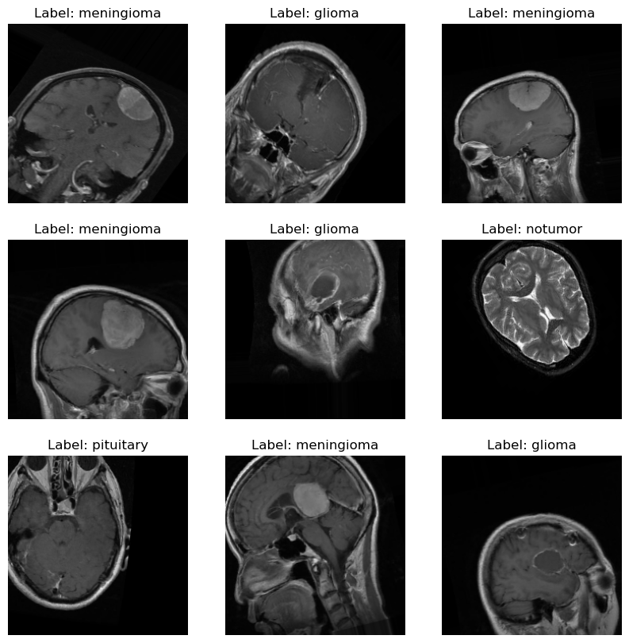

# 🧬 Brain Tumor MRI Classification using Convolutional Neural Networks (CNN)

This project focuses on building and evaluating **Convolutional Neural Network (CNN)** architectures for classifying brain MRI images into four categories: **glioma**, **meningioma**, **pituitary**, and **no tumor**.  
The aim is to explore model performance in multiclass medical image classification using both **baseline AlexNet architecture** and an **enhanced CNN model** with regularization techniques.

---

## 📘 Overview

Early and accurate detection of brain tumors through MRI scans is critical for effective diagnosis and treatment planning.  
This project replicates and modifies the **AlexNet architecture** from scratch (without using pre-trained models) to classify MRI brain images, and later compares it with a modified CNN to evaluate performance improvements.

---

## 🧠 Dataset Overview

The dataset consists of MRI brain images belonging to **four categories**:
- **Glioma**
- **Meningioma**
- **No Tumor**
- **Pituitary**

Each image varies in **lighting, angle, and resolution**, presenting real-world challenges for model generalization.

### Dataset Summary
| Set | Description | Split Ratio |
|------|--------------|-------------|
| **Train Set** | Used for model learning | 70% |
| **Validation Set** | Used for tuning | 15% of training data |
| **Test Set** | Used for final evaluation | 20% |

---

## 🔍 Exploratory Data Analysis (EDA)

EDA was conducted to understand the dataset characteristics:
- **Color histograms** for each tumor type showed distinct intensity distributions.  
- **Image variability** observed in lighting and orientation, suggesting a need for normalization and augmentation.  
- **Aspect ratio and resolution** inconsistencies were standardized to `(224, 224, 3)` to match AlexNet’s input requirement.  

### Data Preprocessing
- Resized all images to 224×224 pixels  
- Normalized pixel values to `[0, 1]` range  
- Applied **data augmentation** (rotation, zoom, flipping)  
- Encoded labels into categorical classes  

---

## ⚙️ Model Architectures

### 🧩 1. Baseline Model: *AlexNet (Manual Implementation)*
The baseline model follows the original **AlexNet** structure:
- 5 convolutional layers with varying filter sizes  
- ReLU activations  
- MaxPooling after early layers  
- Two dense layers (4096 neurons each) with Dropout (0.5)  
- Output layer with Softmax activation for 4 classes  

### 🧪 2. Modified Model: *Enhanced CNN*
To improve generalization, the modified model includes:
- **Leaky ReLU** activations  
- **Batch Normalization** between convolutional layers  
- **Dropout** layers for regularization  
- **Adam optimizer** with tuned learning rate  
- **Early stopping** to prevent overfitting  

---

## 📈 Model Evaluation

### 🔹 Classification Report: Baseline Model
| Metric | Precision | Recall | F1-score |
|--------|-----------|--------|----------|
| Glioma | 0.00 | 0.00 | 0.00 |
| Meningioma | 0.19 | 0.18 | 0.19 |
| No Tumor | 0.27 | 0.84 | 0.41 |
| Pituitary | 0.40 | 0.03 | 0.06 |
| **Accuracy** | **0.26** |  |  |

**Insight:**  
The baseline AlexNet achieved **26% accuracy**, struggling particularly with glioma and pituitary detection due to underfitting and class imbalance.

---

### 🔹 Classification Report: Modified Model
| Metric | Precision | Recall | F1-score |
|--------|-----------|--------|----------|
| Glioma | 0.55 | 0.05 | 0.10 |
| Meningioma | 0.10 | 0.01 | 0.02 |
| No Tumor | 0.29 | 0.24 | 0.26 |
| Pituitary | 0.27 | 0.73 | 0.39 |
| **Accuracy** | **0.28** |  |  |

**Insight:**  
Although accuracy increased slightly to **28%**, the **Modified Model** demonstrated higher recall for *pituitary* cases (0.73), showing improved sensitivity for certain tumor types.

---

## 🧾 Analysis & Conclusion

- The **baseline model** struggled due to limited generalization and possible overfitting on simpler patterns.  
- The **modified model** introduced dropout and normalization layers, improving stability and recall on specific classes.  
- Further improvements can be achieved with **larger dataset**, **data balancing**, and **transfer learning** (e.g., EfficientNet, ResNet).  

> 🔬 Despite modest accuracy, this project successfully demonstrates CNN implementation from scratch and the exploration of deep learning model optimization in a real-world medical imaging context.
